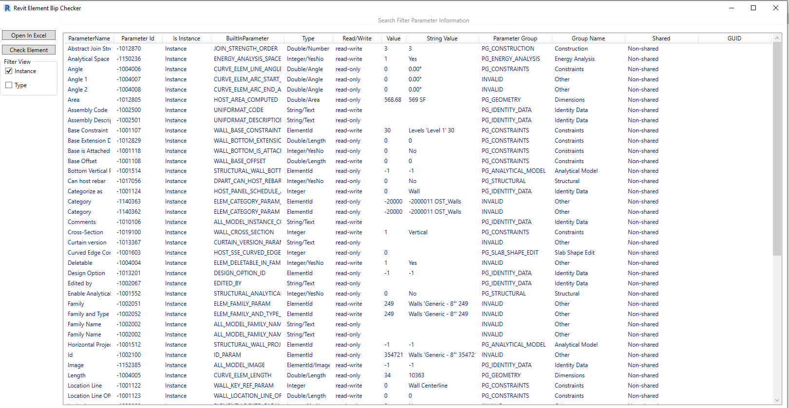

# RevitElementBipChecker
Project Update From  <a href="https://github.com/ottosson">ottosson</a> with WPF Solution And Extend Funtion, fix Error for package nuget dependent old with .NET.
Solution Check Full Parameter : 
- Search Parameter Of Element And Snoop All Value For Developer
- Support Parameter Type And Instance
- Export Parameter to Excel
- Interactive Live With Revit Project 
- Select Quickly Change Snoop Element
Demo:

