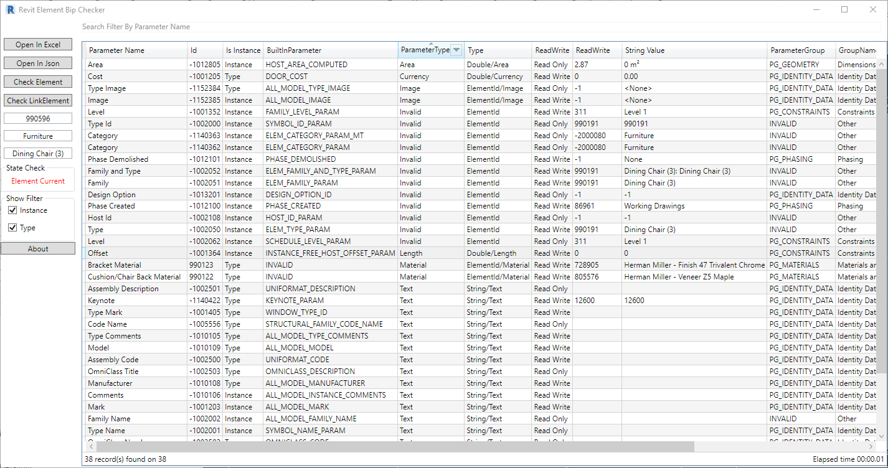
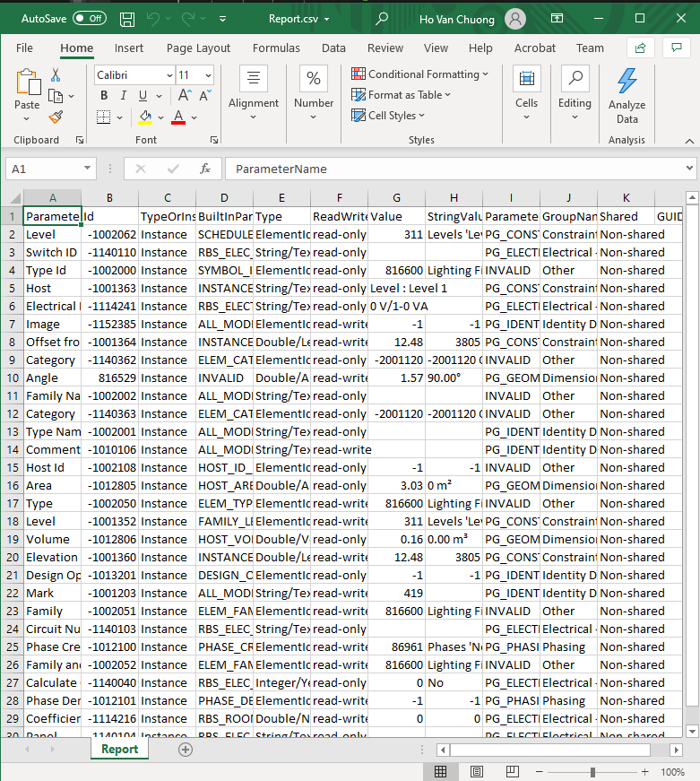
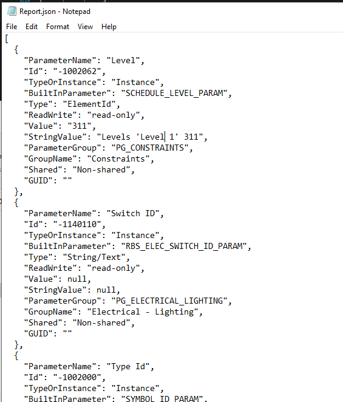

# RevitElementBipChecker


[](https://opensource.org/licenses/MIT)
<a href="https://twitter.com/intent/follow?screen_name=chuongmep">
        </a>
            
Project Update From  <a href="https://github.com/ottosson">ottosson</a> and <a href="https://github.com/jeremytammik">jeremytammik</a> with WPF Solution And Extend Funtion, fix Error for package nuget dependent old with .NET.

### Download 

<a href="https://github.com/chuongmep/RevitElementBipChecker/releases" target="_blank">RevitElementBipChecker</a> 

### Solution Check Full Parameter : 

- Search Parameter Of Element And Snoop All Value For Developer
- Support Parameter Type And Instance
- Export Parameter to Excel (*csv format*)
- Export Parameter to Json (*json format*)
- Interactive Live With Revit Project 
- Select Quickly Change Snoop Element
- Support Snoop LinkedElement
- Support Copy Parameter Infomation

### Select First To Snoop :


### Main Form : 



### Live Snoop


### Data Export Excel 



### Data Export Json 




### Copy Info By Right Click


### How To Use

#### Clone project from :

```
git clone https://github.com/chuongmep/RevitElementBipChecker.git
```
#### Restore nuget : 

1 [https://github.com/chuongmep/RevitAPI-Nuget](https://github.com/chuongmep/RevitAPI-Nuget)

2.[https://github.com/JamesNK/Newtonsoft.Json](https://github.com/JamesNK/Newtonsoft.Json)

### Get Datagrid library from:

<a href="https://github.com/macgile/DataGridFilter" target="_blank">DataGridFilter</a> 

#### Build solution: 

1. _RevitElementBipChecker.dll_
2. _BipChecker.addin_

### Reference

<a href="https://github.com/jeremytammik/BipChecker">jeremytammik</a> 

<a href="https://github.com/ottosson/BipChecker-WPF">ottosson</a> 


### Log Change

1.0.1 : First Release

1.0.2 : Fix Parameter Value String

1.0.3 :

- [x] Add Check Snoop Associated Global Parameter

1.0.4 :
- [x] Add Sort ClickHeader
- [x] Export correct with sort
- [x] Fix Export Character _"_ Unit Inch 