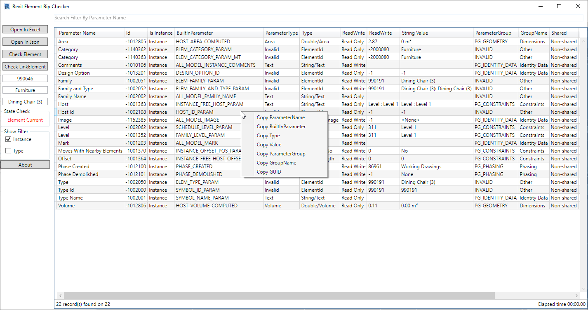

# RevitElementBipChecker

            
Project Update From  <a href="https://github.com/ottosson">ottosson</a> and <a href="https://github.com/jeremytammik">jeremytammik</a> with WPF Solution And Extend Funtion, fix Error for package nuget dependent old with .NET.
Solution Check Full Parameter : 
- Search Parameter Of Element And Snoop All Value For Developer
- Support Parameter Type And Instance
- Export Parameter to Excel
- Interactive Live With Revit Project 
- Select Quickly Change Snoop Element
- Support Snoop LinkedElement
- Support Copy Parameter Infomation

Select First To Snoop :

Live Snoop

Copy Info By Right Click

